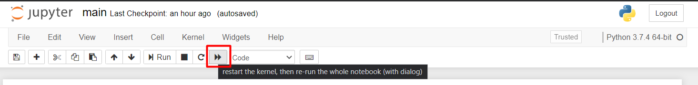
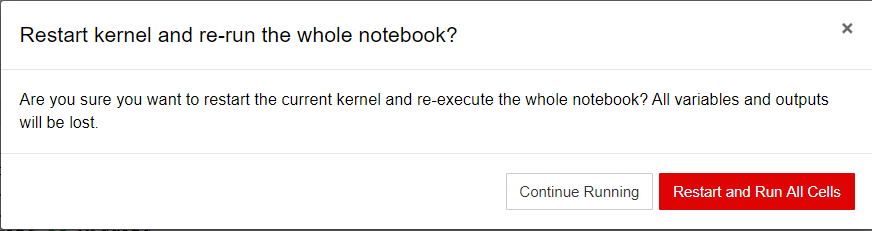
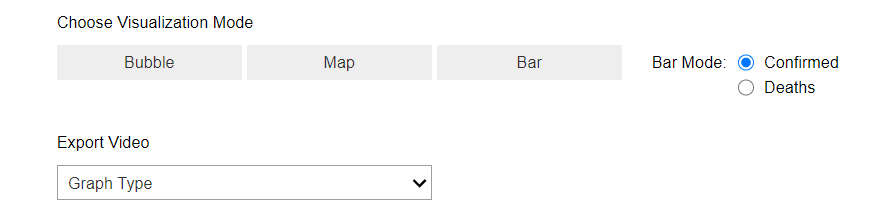
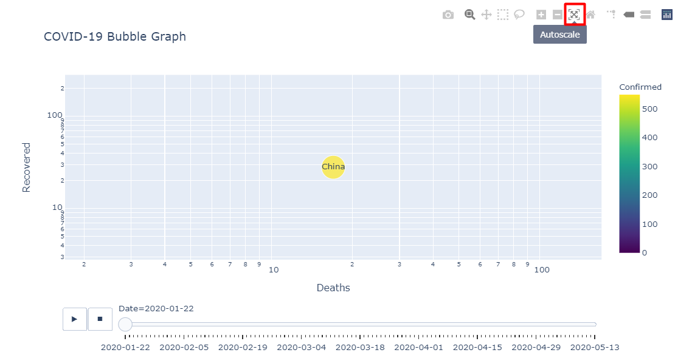
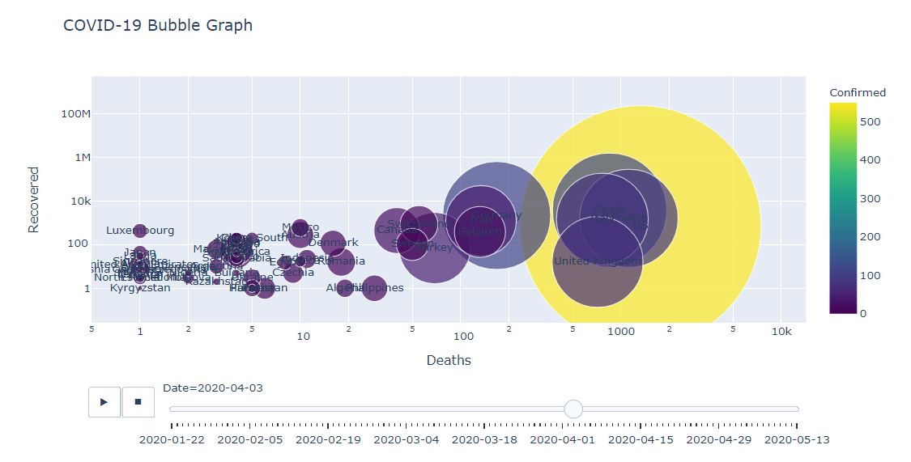
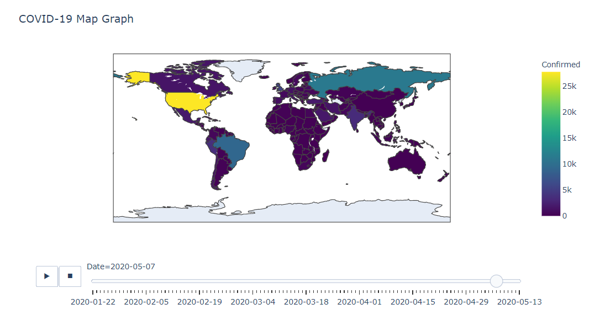
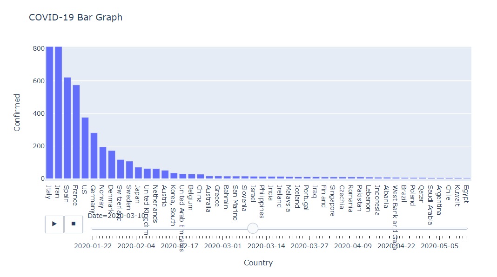
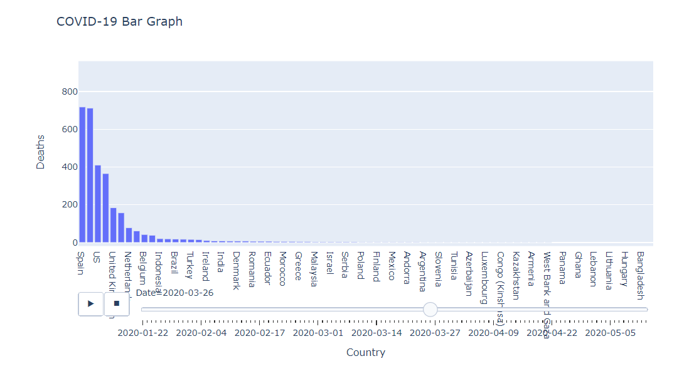
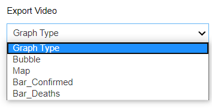

# COVID19 Visualizations

This application used to visualize the COVID-19 data in a 3 different graphs (Bubble, Map and Sorted Bar) with an animation in a nice-look way.

## Data Set
The data set is obtained from kaggle (the world's largest data science community), you could find the source data
<a href="https://www.kaggle.com/imdevskp/corona-virus-report" target="_blank">here</a>.

We've made some refactoring and formatting to this data to make it easier to be understood and to represent it correctly. The date of the recorded data starts from `22-01-2020` till `13-05-2020`.

## Used Tools
This application is built using `Python` and `Jupyter notebook` so it runs in a web-based engine not in a separate GUI application. This application uses a `Plotly` which is a graphing library that makes interactive, publication-quality graphs.

We used `Plotly Express` which is a terse, consistent, high-level API for rapid data exploration and figure generation.

## Basic Usage
To use this application you should have
<a href="https://www.anaconda.com/products/individual" target="_blank">conda</a>
installed on your machine, in addition to `Jupyter notebook`.

There are 2 methods to run this application after installing conda:
#### 1. Using Terminal
Open the terminal in the project directory and type this command:
```python
jupyter notebook main.ipynb
```
This will open a `http://localhost:8888/notebooks/main.ipynb` URL on your default browser.

#### 2. Using Jupyter Notebook Application
Using anaconda navigator, open Jupyter Notebook then choose the notebook file you want to run and open it.

### Jupyter Notebook Interface

In the top of the page you will see this navigation bar:



Click the button with the red square which restarts the kernel and runs all the cells. This message will pop up on the screen:



Choose `Restart and Run All Cells` then wait till the process ends. The running process will take about 20 ~ 30 seconds to complete as the graphs take some times to be prepared.

After this you need to scroll down a bit to see the basic GUI to start using the application. This is what you supposed to see in your screen:



### Results

After clicking on each button, an interactive animation graph will be displayed below it. It has a slider which you could play and stop it as you like to look in a certain date.

In the `Bar Graph`, there's a radio buttons to choose which mode you want to view, either the Confirmed or the Deaths mode. The default mode is `Confirmed`, if you selected `Deaths` you need to click on the `Bar` button again to display it.

##### Note
In each graph, there's a navigation bar on the top right side which has some events you could apply to the graph such as zooming, panning and scaling. In `Bubble Graph` you have to click on `Auto Scale` button to adjust the animation motion correctly.



Then you need to move the slider to the end then pull it back to the start again. This will make the animation works correctly.

Here are some screenshots from the results you're expected to see.

#### 1. Bubble Graph
 
 This is an animated graph in which `x-axis` is the number of deaths, `y-axis` is the number of recovered cases, the size of each country bubble is the number of its cases.
 


#### 2. Map Graph

Using some colormap, each country in each frame is assigned a color that indicates the number of cases or the number of death cases in this country.



#### 3. Bar Graph - Confirmed Mode

This is a Sorted chart (i.e. bar rank) where each country is represented as bar on the chart. The length of the bar is the number of cases or deaths. The bars are always sorted (according to the number of cases or deaths. This is an option in the UI).



#### 4. Bar Graph - Deaths Mode



### Video Exporting
As you see below the buttons there's a drop menu for exporting the animation video. You could selected the type of graph you want to export, then wait for 15 ~ 20 seconds till the process ends. 



You will find the videos in a `results` folder in the project directory.


